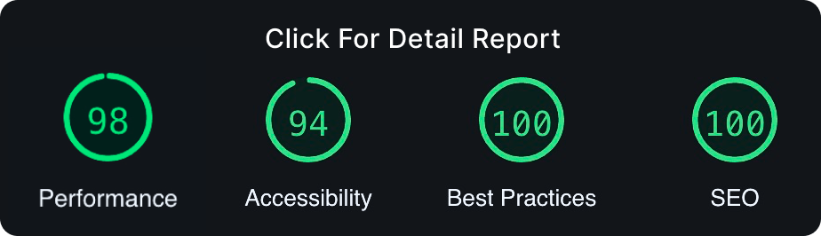
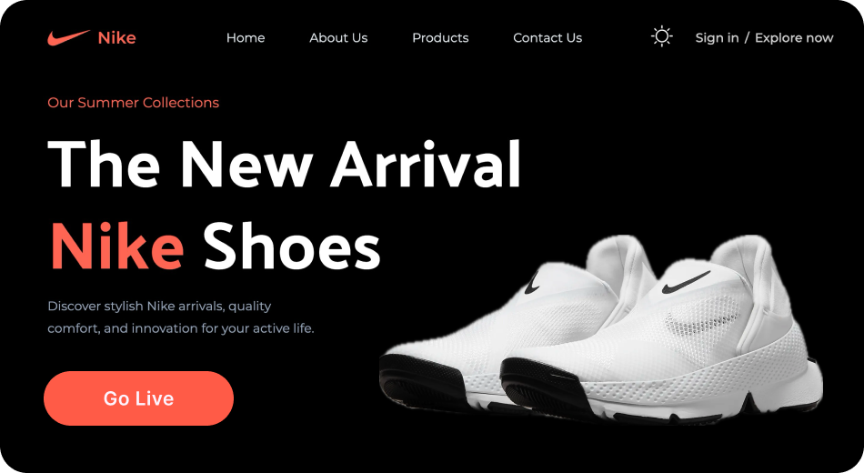

<a href="https://nike-shoe-landing.vercel.app">
  <h1 align="center">Nike - Just Do It</h1>
</a>

<p align="center">
  A nike shoes website showcasing popular shoes, trending products, and best offers.
</p>

<a href="https://pagespeed.web.dev/analysis/https-nike-shoe-landing-vercel-app/euljujvlkv?form_factor=desktop">
   <p align=center>
    
  <p>
</a>

<div align= "center">

[](https://twitter.com/KadlagAkash) &nbsp; [](https://www.linkedin.com/in/kadlagakash/) &nbsp; [](mailto:akashkadlag14@gmail.com) &nbsp; [](https://conventionalcommits.org)&nbsp; [](https://choosealicense.com/licenses/mit/)

</div>

<h2 align="center">

[🚀&nbsp; Explore Demo](https://nike-shoe-landing.vercel.app) &nbsp;&nbsp;&nbsp;&nbsp;&nbsp;&nbsp; [📂&nbsp; Source Code](https://github.com/KadlagAkash/nike-landing)

</h2>
<br>

<p align="center">
  <a href="#introduction"><strong>Introduction</strong></a> 
	·&nbsp;<a href="#features"><strong>Features</strong></a> 
	·&nbsp;<a href="#tech-stack"><strong>Tech Stack</strong></a>
	·&nbsp;<a href="#local-development"><strong>Development Setup</strong></a> 
	·&nbsp;<a href="#snippets"><strong>Snippets</strong></a> 
</p>
<br>

## <a name="introduction">❄️&nbsp; Introduction</a>

This repository showcases my developer journey through the creation of Nike, a shoes website. Feel free to delve into the codebase to uncover the magic of Nike's development.

<a href="https://nike-shoe-landing.vercel.app">
   <p align=center>
    
  <p>
</a>
<br>

## <a name="features">🔋&nbsp; Features</a>

- **Best Practices**: Tailwind's best practices for efficient and maintainable code.

- **Theming**: Different themes to website using Tailwind CSS.

- **JavaScript-like Tasks with Tailwind**: Discover how Tailwind CSS can be used to achieve tasks that typically require JavaScript code

- **Complex Hero Section**: A visually appealing hero section showcasing key elements.

- **Popular Products Showcase**: A section highlighting popular Nike products

- **About Us Section**: An informative "About Us" section with a unique design.

- **Special Offers**: Showcase special offers in an eye-catching manner

- **Testimonials**: A testimonials section for a captivating user experience

- **Newsletter Integration**: A newsletter section with Tailwind styling, encouraging user engagement

- **Footer**: A comprehensive footer section containing various links

- **Mobile Responsive**: The entire website is responsive across various devices, emphasizing Tailwind's mobile-friendly capabilities.
  <br><br>

## <a name="tech-stack">⚙️&nbsp; Tech Stack</a>

- [React](https://react.dev/) – library for building UI
- [Tailwind CSS](https://tailwindcss.com/) – utility-first CSS framework
- [Git](https://git-scm.com/) – versioning
- [Vite](https://vitejs.dev/) – building
- [Vercel](https://vercel.com/) – deployments
  <br><br>

## <a name="local-development"> 🖥️&nbsp;&nbsp; Local Development</a>

0. **Prerequisites** <br>
   Make sure you have the following installed on your machine:

   - [Git](https://git-scm.com/)
   - [Node.js](https://nodejs.org/en)
   - [npm](https://www.npmjs.com/) (Node Package Manager)

1. **Clone the repository:**

   ```bash
   git clone https://github.com/KadlagAkash/nike-landing.git
   ```

2. **Navigate to the project directory:**

   ```bash
   cd nike-landing
   ```

3. **Install dependencies:**

   ```bash
   npm install
   ```

4. **Run the project:**

   ```bash
   npm run dev
   ```

5. **Open your browser:**

   Visit [http://localhost:5173](http://localhost:5173) to view the project.

6. **Build the project for production:**
   ```bash
   npm run build
   ```
   <br>

## <a name="snippets"> 🕸️&nbsp;&nbsp;Snippets </a>

<details>
<summary>&nbsp;&nbsp;<code>.eslintrc.cjs</code></summary>

```javascript
module.exports = {
  root: true,
  env: {browser: true, es2020: true},
  extends: [
    'eslint:recommended',
    'plugin:react/recommended',
    'plugin:react/jsx-runtime',
    'plugin:react-hooks/recommended',
  ],
  ignorePatterns: ['dist', '.eslintrc.cjs'],
  parserOptions: {ecmaVersion: 'latest', sourceType: 'module'},
  settings: {react: {version: '18.2'}},
  plugins: ['react-refresh'],
  rules: {
    'react/jsx-no-target-blank': 'off',
    'react-refresh/only-export-components': [
      'warn',
      {allowConstantExport: true},
    ],
    'react/prop-types': 0,
  },
};
```

</details><br>

<details>
<summary>&nbsp;&nbsp;<code>constants.index.js</code></summary>

```javascript
import {
  github,
  linkedin,
  shieldTick,
  support,
  truckFast,
  twitter,
} from '../assets/icons';

import {
  bigShoe1,
  bigShoe2,
  bigShoe3,
  customer1,
  customer2,
  shoe4,
  shoe5,
  shoe6,
  shoe7,
  thumbnailShoe1,
  thumbnailShoe2,
  thumbnailShoe3,
} from '../assets/images';

export const navLinks = [
  {href: '#home', label: 'Home'},
  {href: '#about-us', label: 'About Us'},
  {href: '#products', label: 'Products'},
  {href: '#contact-us', label: 'Contact Us'},
];

export const shoes = [
  {
    thumbnail: thumbnailShoe1,
    bigShoe: bigShoe1,
  },
  {
    thumbnail: thumbnailShoe2,
    bigShoe: bigShoe2,
  },
  {
    thumbnail: thumbnailShoe3,
    bigShoe: bigShoe3,
  },
];

export const statistics = [
  {value: '1k+', label: 'Brands'},
  {value: '500+', label: 'Shops'},
  {value: '250k+', label: 'Customers'},
];

export const products = [
  {
    imgURL: shoe4,
    name: 'Nike Air Jordan-01',
    price: '$200.20',
    rating: '4.5',
  },
  {
    imgURL: shoe5,
    name: 'Nike Air Jordan-10',
    price: '$210.20',
    rating: '4.6',
  },
  {
    imgURL: shoe6,
    name: 'Nike Air Jordan-100',
    price: '$220.20',
    rating: '4.7',
  },
  {
    imgURL: shoe7,
    name: 'Nike Air Jordan-001',
    price: '$230.20',
    rating: '4.9',
  },
];

export const services = [
  {
    imgURL: truckFast,
    label: 'Free shipping',
    subtext: 'Enjoy seamless shopping with our complimentary shipping service.',
  },
  {
    imgURL: shieldTick,
    label: 'Secure Payment',
    subtext:
      'Experience worry-free transactions with our secure payment options.',
  },
  {
    imgURL: support,
    label: 'Love to help you',
    subtext: 'Our dedicated team is here to assist you every step of the way.',
  },
];

export const reviews = [
  {
    imgURL: customer1,
    customerName: 'Morich Brown',
    rating: 4.5,
    feedback:
      'The attention to detail and the quality of the product exceeded my expectations. Highly recommended!',
  },
  {
    imgURL: customer2,
    customerName: 'Lota Mongeskar',
    rating: 4.8,
    feedback:
      "The product not only met but exceeded my expectations. I'll definitely be a returning customer!",
  },
];

export const footerLinks = [
  {
    title: 'Products',
    links: [
      {name: 'Air Force 1', link: '/'},
      {name: 'Air Max 1', link: '/'},
      {name: 'Air Jordan 1', link: '/'},
      {name: 'Air Force 2', link: '/'},
      {name: 'Nike Waffle Racer', link: '/'},
      {name: 'Nike Cortez', link: '/'},
    ],
  },
  {
    title: 'Help',
    links: [
      {name: 'About us', link: '/'},
      {name: 'FAQs', link: '/'},
      {name: 'How it works', link: '/'},
      {name: 'Privacy policy', link: '/'},
      {name: 'Payment policy', link: '/'},
    ],
  },
  {
    title: 'Get in touch',
    links: [
      {name: 'customer@nike.com', link: 'mailto:customer@nike.com'},
      {name: '+92554862354', link: 'tel:+92554862354'},
    ],
  },
];

export const socialMedia = [
  {
    src: github,
    alt: 'github logo',
    href: 'https://github.com/',
  },
  {
    src: linkedin,
    alt: 'linkedin logo',
    href: 'https://www.linkedin.com/in/',
  },
  {src: twitter, alt: 'twitter logo', href: 'https://twitter.com/'},
];
```

</details><br>

<details>
<summary>&nbsp;&nbsp;<code>index.css</code></summary>

```css
@import url('https://fonts.googleapis.com/css2?family=Montserrat:wght@100;200;300;400;500;600;700;800;900&family=Palanquin:wght@100;200;300;400;500;600;700&display=swap');
@import url('https://fonts.googleapis.com/css2?family=Palanquin:wght@100;200;300;400;500;600;700&display=swap');

@tailwind base;
@tailwind components;
@tailwind utilities;

* {
  margin: 0;
  padding: 0;
  box-sizing: border-box;
  scroll-behavior: smooth;
}

@layer components {
  .max-container {
    max-width: 1440px;
    margin: 0 auto;
  }

  .input {
    @apply border pl-5 text-base leading-normal text-slate-gray outline-none dark:bg-transparent dark:text-white-400 dark:placeholder:text-slate-400 max-sm:w-full max-sm:rounded-full max-sm:border-slate-gray max-sm:p-5 sm:flex-1 sm:border-none;
  }
}

@layer utilities {
  .padding {
    @apply px-8 py-12 sm:px-16 sm:py-24;
  }

  .padding-x {
    @apply px-8 sm:px-16;
  }

  .padding-y {
    @apply py-12 sm:py-24;
  }

  .padding-l {
    @apply pl-8 sm:pl-16;
  }

  .padding-r {
    @apply pr-8 sm:pr-16;
  }

  .padding-t {
    @apply pt-12 sm:pt-24;
  }

  .padding-b {
    @apply pb-12 sm:pb-24;
  }

  .info-text {
    @apply font-montserrat text-lg leading-7 text-slate-gray dark:text-slate-400;
  }
}
```

</details><br>

<details>
<summary>&nbsp;&nbsp;<code>tailwind.config.js</code></summary>

```javascript
/** @type {import('tailwindcss').Config} */
export default {
  content: ['./index.html', './src/**/*.{js,ts,jsx,tsx}'],
  darkMode: 'class',
  theme: {
    fontSize: {
      xs: ['12px', '16px'],
      sm: ['14px', '20px'],
      base: ['16px', '19.5px'],
      lg: ['18px', '21.94px'],
      xl: ['20px', '24.38px'],
      '2xl': ['24px', '29.26px'],
      '3xl': ['28px', '50px'],
      '4xl': ['48px', '58px'],
      '8xl': ['96px', '106px'],
    },
    extend: {
      fontFamily: {
        palanquin: ['Palanquin', 'sans-serif'],
        montserrat: ['Montserrat', 'sans-serif'],
      },
      colors: {
        dark: {
          primary: '#2D3748',
        },
        primary: '#ECEEFF',
        'coral-red': '#FF6452',
        'slate-gray': '#6D6D6D',
        'pale-blue': '#F5F6FF',
        'white-400': 'rgba(255, 255, 255, 0.80)',
      },
      boxShadow: {
        '3xl': '0 10px 40px rgba(0, 0, 0, 0.1)',
      },
      backgroundImage: {
        hero: "url('assets/images/collection-background.svg')",
        'hero-dark': "url('assets/images/collection-background-dark.svg')",
        card: "url('assets/images/thumbnail-background.svg')",
        'card-dark': "url('assets/images/thumbnail-background-dark.svg')",
      },
      screens: {
        wide: '1440px',
      },
    },
  },
  plugins: [],
};
```

</details><br>

## 🪪&nbsp;&nbsp; Licensing Information

- This project was built while following an in-depth tutorial from the [JavaScript Mastery](https://www.youtube.com/@javascriptmastery/videos) YouTube channel.

- It is licensed under the [MIT License](./LICENSE). Feel free to learn, add upon, and share!
